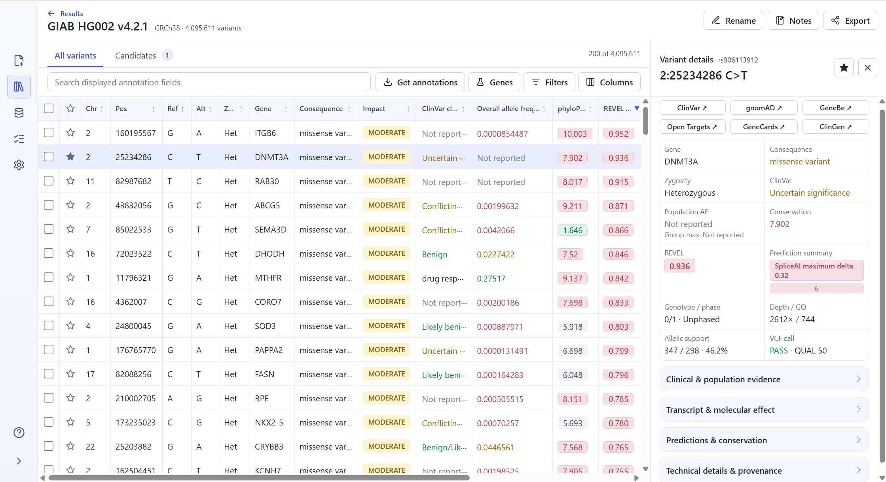

# AnnoCAT

[](LICENSE)
[](#installation)
[](https://github.com/annocat-project/AnnoCAT/releases)

AnnoCAT is a local application for genomic variant annotation and review. It is
designed to process GRCh38 VCF files from panels, exomes, and whole genomes, and
to make the resulting alleles easy to search, filter, sort, and inspect.



AnnoCAT uses a bundled, pinned [fastVEP](https://github.com/annocat-project/fastVEP)
build to add Ensembl transcript consequences and HGVS descriptions. Installed
data sources add clinical assertions, population frequencies, reference
identifiers, conservation scores, and computational predictions. AnnoCAT
provides a desktop viewer and command-line interface. Result ZIPs can be opened
on another AnnoCAT installation.

Core annotation and result review run locally. Network access is used to install
or update data sources. After a result opens, the viewer can request FAVOR
annotations for selected variants or the current filtered result.

## Installation

1. Download the latest Windows ZIP from
   [GitHub Releases](https://github.com/annocat-project/AnnoCAT/releases).
2. Extract the complete ZIP to a folder.
3. Double-click `launch-annocat.cmd`.
4. Keep the terminal window open while AnnoCAT is running.

The release contains AnnoCAT, its internal annotation engine, and the required
software libraries. It does not require Rust, Python, Node.js, Docker, or a
separate database server.

On first launch, select **Open results** to view an existing AnnoCAT result, or
select **Set up annotation** to install the GRCh38 reference, transcript data,
and annotation sources. Existing results do not require installed annotation
data or an internet connection.

### Requirements

- 64-bit Windows 10 or Windows 11
- GRCh38 VCF, VCF.GZ, or BGZ input
- Internet access for data-source installation, updates, and online annotations
- Enough storage for the selected data sources and results

## Annotation

Open **New annotation**, select one or more VCF files, choose an annotation
profile, review the output location, and start the annotation. Each input VCF
creates a separate AnnoCAT result. AnnoCAT does not combine VCF files or samples.

| Profile | Data sources |
|---|---|
| **Standard** | Core annotation, ClinVar, dbSNP, gnomAD exomes, PhyloP, and REVEL |
| **Comprehensive** | Core annotation, dbNSFP, ClinVar, dbSNP, gnomAD genomes, CADD, PhyloP, and SpliceAI |
| **Core annotation** | fastVEP transcript consequences and HGVS; FAVOR annotations can be requested later in the result viewer |
| **Custom** | A user-selected combination of installed sources |

Use **Data sources** to install, configure, verify, update, or remove annotation
data. AnnoCAT shows known download and storage sizes before installation.

## Results

The results table contains one row per alternate allele. It supports whole-result
search, structured filters, multi-column sorting, selectable columns, gene lists,
and transcript-aware evidence. Select a row to review its consequences, HGVS
descriptions, sample call, source annotations, and provenance.

Use Candidates to bookmark variants for follow-up. Select individual variants or
all variants in the current search or filter, then export the selection as a CSV
file or a gene list.

AnnoCAT can export a result as a validated ZIP containing its variants,
annotations, provenance, online annotations, and candidate bookmarks. Imported
results appear under **Results**. Notes remain on the computer where they were
created.

Prediction colors and scores help compare computational evidence across variants.

## Command line

The CLI uses the same configuration, annotation data, results, validation, and
recovery workflows as the desktop application. Run `annocat --help` for the full
command reference.

```text
annocat status --profile standard
annocat sources install --profile standard
annocat annotate -i sample.vcf.gz --profile standard
annocat results list
annocat results export RESULT_ID -o result.zip
annocat tasks list
```

Repeat `-i` to annotate a sequential batch. Repeat `--source` instead of using a
profile to select exact sources. Supported read commands accept `--json` for
machine-readable output.

## Documentation

- [Install and update AnnoCAT](docs/installation.md)
- [Create an annotation result](docs/annotation.md)
- [Review, filter, and export results](docs/results.md)
- [Use the command line](docs/cli.md)
- [Understand local data and network use](docs/data-and-privacy.md)
- [Browse all maintained documentation](docs/README.md)

## Development

Building from source requires a Rust toolchain. End users should use the packaged
release.

```text
cargo test --workspace
cargo run -p annocat-cli -- launch
```

AnnoCAT uses an exact, tested fastVEP revision recorded in
[`config/fastvep-pin.json`](config/fastvep-pin.json). Release packaging verifies
that source revision and its dependency lock before building the bundled binary.

## Intended use

AnnoCAT is for research and educational use only. It has not received regulatory
clearance or approval for diagnostic or clinical use. Do not use AnnoCAT or its
outputs for diagnosis, screening, prognosis, treatment selection, or other
patient-care decisions.

Results can be incomplete or incorrect and depend on third-party data sources and
computational predictions. Check relevant findings against the original data
sources. Do not treat AnnoCAT output as a validated clinical finding.

## License

AnnoCAT is licensed under the [Apache License 2.0](LICENSE). It bundles a modified
Apache-2.0 fastVEP build. Downloaded reference and annotation data remain subject
to their publishers' licenses, permitted uses, and citation requirements.

For problems and feature requests, use
[GitHub Issues](https://github.com/annocat-project/AnnoCAT/issues).
